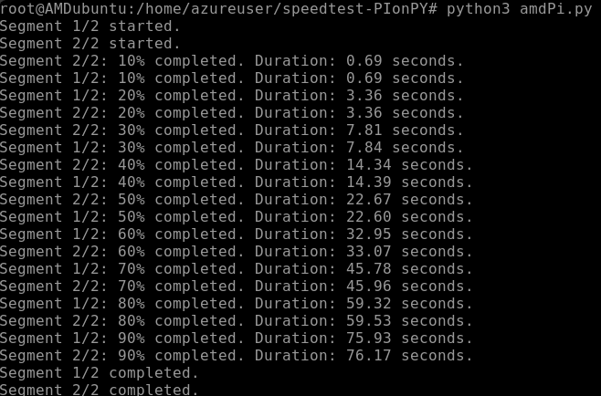
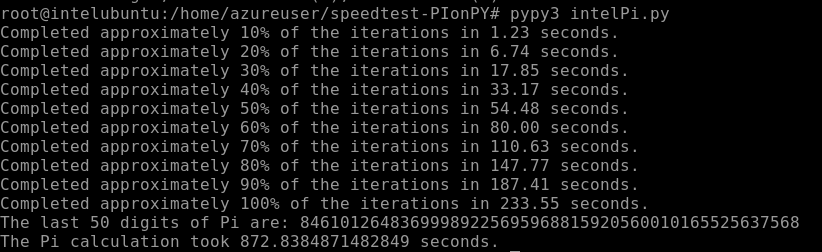

# SpeedTest: Pi-on-Py

  

Welcome to the Pi-on-Py Speedtest, a Python project dedicated to exploring and benchmarking the performance of calculating Pi across various CPU architectures. This project aims to provide insights into how different computational strategies and optimizations can impact the efficiency and speed of Pi calculations on diverse hardware setups.

## Project Overview

The Pi-on-Py Speedtest leverages advanced mathematical algorithms and Python's multiprocessing capabilities to divide and conquer the task of calculating Pi. By optimizing for different CPU architectures, this project sheds light on the fascinating world of computational mathematics and its practical implications in hardware performance.

## Features

- **Multi-Architecture Support**: Tailored optimizations for a variety of CPU architectures to ensure maximum performance.
- **High Precision Calculations**: Utilize Python's `mpmath` library for high-precision Pi calculations.
- **Benchmarking Tools**: Includes tools for benchmarking and comparing performance across different systems.
- **Progress Reporting**: Real-time progress reporting for long-running calculations, providing insights into the calculation process.

## Understanding CPU Architecture Differences

The SpeedTest-PiOnPy project is designed to run on multiple CPU architectures, including Arm, AMD, and Intel. Each of these architectures has unique characteristics that can impact the performance of computational tasks. Here's a brief overview:

- **Arm**: Known for its power efficiency, Arm processors are widely used in mobile devices and increasingly in servers and desktops. The project's optimizations for Arm focus on maximizing performance per watt, making it ideal for energy-conscious environments.

- **AMD**: AMD CPUs, particularly those with the EPYC architecture, offer a high number of cores and threads, making them well-suited for parallel processing tasks. The optimizations for AMD aim to leverage this multi-threading capability to speed up the Pi calculation process.

- **Intel**: Intel processors are renowned for their high single-core performance, which is crucial for tasks that cannot be easily parallelized. The project includes specific optimizations for Intel CPUs to take advantage of their architecture, such as using `pypy` for faster Python execution. `pypy` is a Python interpreter with a JIT (Just-In-Time) compilation feature that accelerates the execution of Python code, making it a perfect match for Intel's high-performance cores.

By tailoring the optimizations to each CPU architecture, Pi-on-Py ensures that users can achieve the best possible performance regardless of their hardware setup. This approach allows for a more accurate comparison of hardware capabilities across different systems and architectures.

## Getting Started

To get started, follow these simple steps:

1.) **Clone the Repository**

``bash git clone https://github.com/yourusername/speedtest-PIonPY.git``

``cd speedtest-PIonPY``

2.) **Install Dependencies**

Ensure you have Python 3.x installed on your system. Then, install the required Python libraries:

For Arm and AMD:

``sudo apt install python3-pip``

``pip install -r requirements.txt``

For Intel:

``sudo apt install python3-pip pypy``

``pypy3 -m pip install -r requirements.txt``

3.) **Run the Benchmark**

Execute the main script to start the benchmark:

For Arm: ``python3 armPi.py``

For AMD: `python3 amdPi.py`

For Intel:

``pypy3 intelPi.py``

## Contributing

I welcome contributions from the community! Whether it's adding new optimizations, improving the documentation, or reporting bugs, your contributions are greatly appreciated. Please refer to the CONTRIBUTING.md file for more information on how to contribute.

### To-Do List

Here are the next steps for the SpeedTest-PiOnPy project to enhance its functionality and user experience:

- [ ] **Community Review on Arm Optimization**: Having run these tests multiple ways, I assume there are significant optimizations that could be made to the Arm benchmark.
- [ ] **Optimize Algorithm Efficiency**: Further refine the mathematical algorithms to improve calculation speed without sacrificing accuracy.
- [ ] **Enhance User Interface**: Develop a more interactive and user-friendly interface for the benchmarking tools.

## Acknowledgments

This project owes its existence to the invaluable assistance provided by ChatGPT and GitHub Copilot. Their contributions have been instrumental in shaping the project's direction and implementation. In the spirit of good humor, any issues encountered will be cheerfully blamed on them. :smile:

## License

This project is licensed under the MIT License - see the LICENSE file for details.
