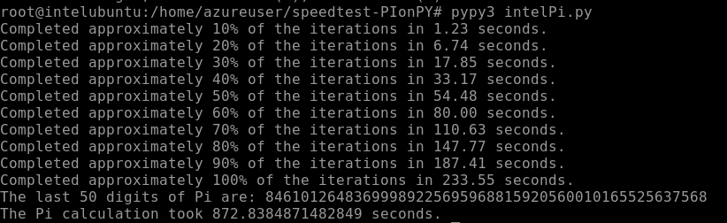

# SpeedTest: Pi-on-Py

<p align="center">
  
</p>

Welcome to the Pi-on-Py Speedtest, a Python project dedicated to exploring and benchmarking the performance of calculating Pi across various CPU architectures. This project aims to provide insights into how different computational strategies and optimizations can impact the efficiency and speed of Pi calculations on diverse hardware setups.

## Project Overview

The Pi-on-Py Speedtest leverages advanced mathematical algorithms and Python's multiprocessing capabilities to divide and conquer the task of calculating Pi. By optimizing for different CPU architectures, this project sheds light on the fascinating world of computational mathematics and its practical implications in hardware performance.

## Features

- **Multi-Architecture Support**: Tailored optimizations for a variety of CPU architectures to ensure maximum performance.
- **High Precision Calculations**: Utilize Python's `mpmath` library for high-precision Pi calculations.
- **Benchmarking Tools**: Includes tools for benchmarking and comparing performance across different systems.
- **Progress Reporting**: Real-time progress reporting for long-running calculations, providing insights into the calculation process.

## Understanding CPU Architecture Differences

The SpeedTest-PiOnPy project is designed to run on multiple CPU architectures, including Arm, AMD, and Intel. Each of these architectures has unique characteristics that can impact the performance of computational tasks. Here's a brief overview:

- **Arm**: Known for its power efficiency, Arm processors are widely used in mobile devices and increasingly in servers and desktops. The project's optimizations for Arm leverage multiprocessing to distribute the Pi calculation workload across all available CPU cores, maximizing performance per watt and making it ideal for energy-conscious environments.

- **AMD**: AMD CPUs, particularly those with the EPYC architecture, offer a high number of cores and threads, making them well-suited for parallel processing tasks. The optimizations for AMD aim to leverage this multi-threading capability to speed up the Pi calculation process.

- **Intel**: Intel processors are renowned for their high single-core performance, which is crucial for tasks that cannot be easily parallelized. The project includes specific optimizations for Intel CPUs to take advantage of their architecture, such as using `pypy` for faster Python execution. `pypy` is a Python interpreter with a JIT (Just-In-Time) compilation feature that accelerates the execution of Python code, making it a perfect match for Intel's high-performance cores.

By tailoring the optimizations to each CPU architecture, Pi-on-Py ensures that users can achieve the best possible performance regardless of their hardware setup. This approach allows for a more accurate comparison of hardware capabilities across different systems and architectures.

## Getting Started

To get started, follow these simple steps:

1.) **Clone the Repository**

``git clone https://github.com/matthansen0/speedtest-PIonPY``

``cd speedtest-PIonPY``

2.) **Install Dependencies**

Ensure you have Python 3.x installed on your system. Then, install the required Python libraries:

**Recommended: Use a Python virtual environment (works for AMD, ARM, and Intel):**

```bash
sudo apt install python3-pip python3-venv -y
```

```bash
python3 -m venv venv
source venv/bin/activate
pip install -r requirements.txt
```

3.) **Prepare Environment (One-Time or Re-Runnable)**

```bash
python3 prepare_benchmark.py
```

This creates/updates `./venv`, installs dependencies, and (optionally) suggests PyPy.

4.) **Run the Benchmark**

```bash
python3 run_benchmark.py
```

You do NOT need to `source venv/bin/activate`; the benchmark will automatically re-exec inside the local venv and (on Intel/AMD) a PyPy JIT venv if available.

Output shows detected vendor, elapsed time (color-coded), last 50 digits (approximate), and writes a JSON results file (e.g. `results_*.json`).

Automatic optimizations now included:
* Warm-up pass (1% of iterations) for cache/JIT stabilization
* Core affinity pinning (best-effort) to reduce migration
* ARM big.LITTLE frequency weighting (allocates more work to faster cores)
* Intel/AMD auto re-exec under PyPy via a local managed venv (.pypy_venv) for JIT speedups (safe under PEP 668)
* JSON result artifact for later comparison
* Always-on per-segment (10%) progress reporting

Progress checkpoints (10% per worker segment) are displayed by default. Iteration count is fixed internally (10,000) for consistent cross-architecture comparison; a warm-up (unreported) precedes the main run.

Typical full usage flow (no flags anywhere):

```bash
python3 prepare_benchmark.py
python3 run_benchmark.py
```

### PyPy Optimization Details

When running on Intel or AMD, the script attempts to speed up execution by:

1. Detecting a `pypy3` executable.
2. Creating a project-local virtual environment at `.pypy_venv/` (if not already present).
3. Ensuring `mpmath` is installed inside that venv.
4. Re‑executing the benchmark under that PyPy environment.

This approach avoids installing packages into the system Python (respects PEP 668) and keeps everything self‑contained in the repository folder.

Environment controls:

```bash
# Skip attempting PyPy entirely (force current interpreter)
SKIP_PYPY=1 python3 run_benchmark.py
```

If you do not have PyPy installed yet on Debian/Ubuntu:

```bash
sudo apt update
sudo apt install pypy3 pypy3-venv -y
```

After that, just run the benchmark again—`.pypy_venv` will be created automatically on first use.



## Notes on Accuracy & Future Enhancements

The current single-script benchmark uses an approximate segmented parallel method to stress CPUs uniformly. It is suitable for relative throughput comparisons (the goal of this project) but is not a mathematically strict parallelization of the Chudnovsky series. Future improvements may include:

- Exact per-term or binary-splitting implementation (mathematically rigorous)
- JSON output mode for automated comparisons
- Optional correctness validation against known π prefixes
- Thermal / frequency sampling during runs

## Contributing

I welcome contributions from the community! Whether it's adding new optimizations, improving the documentation, or reporting bugs, your contributions are greatly appreciated. Please refer to the CONTRIBUTING.md file for more information on how to contribute.

### To-Do List

Here are the next steps for the SpeedTest-PiOnPy project to enhance its functionality and user experience:

- [ ] **Optimize Algorithm Efficiency**: Further refine the mathematical algorithms to improve calculation speed without sacrificing accuracy.
- [ ] **Enhance User Interface**: Develop a more interactive and user-friendly interface for the benchmarking tools.

## Acknowledgments

This project owes its existence to the invaluable assistance provided by ChatGPT and GitHub Copilot. Their contributions have been instrumental in shaping the project's direction and implementation. In the spirit of good humor, any issues encountered will be cheerfully blamed on them. :smile:

## License

This project is licensed under the MIT License - see the LICENSE file for details.
